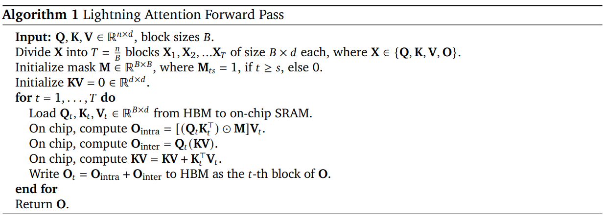

### Lightning Attention
Lightning Attention is a faster way to compute attention in neural networks. It works by processing smaller chunks of input data (queries, keys, and values) and storing temporary results in on-chip memory, reducing the need to access slower global memory. This makes attention computation more efficient, especially for large models.

### Paper Notes
[Link to Paper:](https://arxiv.org/abs/2501.08313)

